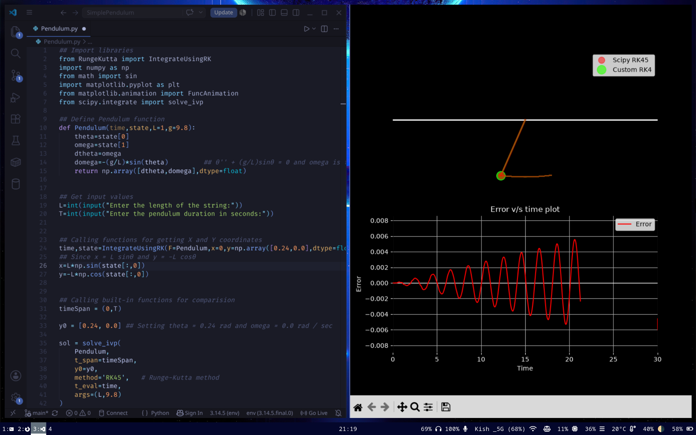

# Simple Pendulum Simulation using RK4

This project implements the classical **4th Order Runge-Kutta (RK4)** numerical integration method in Python and compares its performance against SciPy’s built-in **RK45** solver for simulating the motion of a simple pendulum.

The simulation also includes:

- Real-time pendulum animation
- Comparison between custom RK4 and SciPy RK45 trajectories
- Error analysis over time
- Visualization of numerical drift/error growth

---

# Features

- Custom implementation of RK4
- Simulation of a nonlinear simple pendulum
- Comparison with `scipy.integrate.solve_ivp`
- Real-time animation using Matplotlib
- Error vs Time visualization
  
---
# Assumptions

- No damping or air resistance
- Constant gravitational acceleration
- Small initial angular displacement
- Ideal pendulum motion
- Fixed pendulum length

---

# Numerical Methods Used

## Custom RK4 Solver

The project implements the classical 4th-order Runge-Kutta method manually.

## SciPy RK45 Solver

SciPy’s adaptive Runge-Kutta-Fehlberg solver (`RK45`) is used as a reference solution for comparison.

---

Observations from the simulation:

- The RK4 implementation closely follows SciPy’s RK45 solution
- Error increases gradually over time
- The error growth was observed to be approximately linear for the chosen step size and simulation duration

---

# Installation

Clone the repository:

```bash
git clone https://github.com/kishore-1754/SimplePendulum.git && cd SimplePendulum
````

Install dependencies:

```bash
pip install -r requirements.txt
```
---

# Running the Simulation

Run the program using:

```bash
python Pendulum.py
```

You will be prompted to enter:

* Pendulum length
* Simulation duration
---

# Visualization

The simulation window displays:

## Top Panel

* Pendulum animation
* Custom RK4 trajectory
* SciPy RK45 trajectory
* Motion trails

## Bottom Panel

* Error vs Time graph
* Evolution of numerical error over simulation time

---

# Coordinate Transformation

The pendulum coordinates are computed using:

x=L\sin(\theta)

y=-L\cos(\theta)

---

# License

This project is open-source and available under the MIT License.

